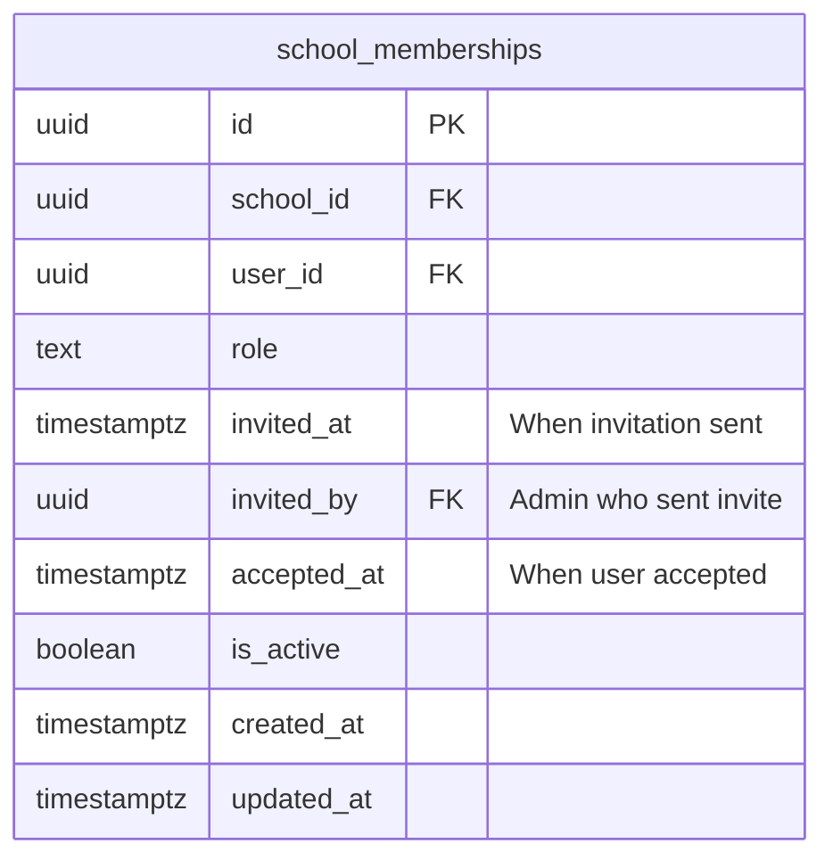
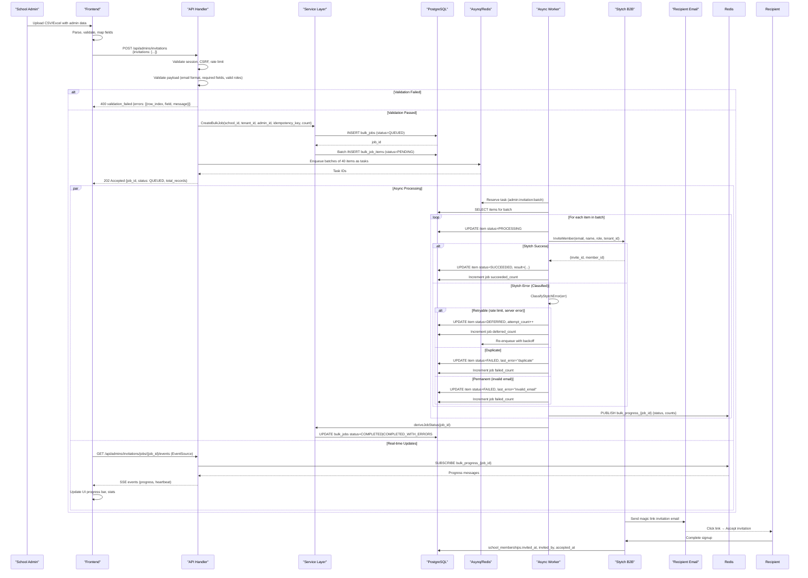
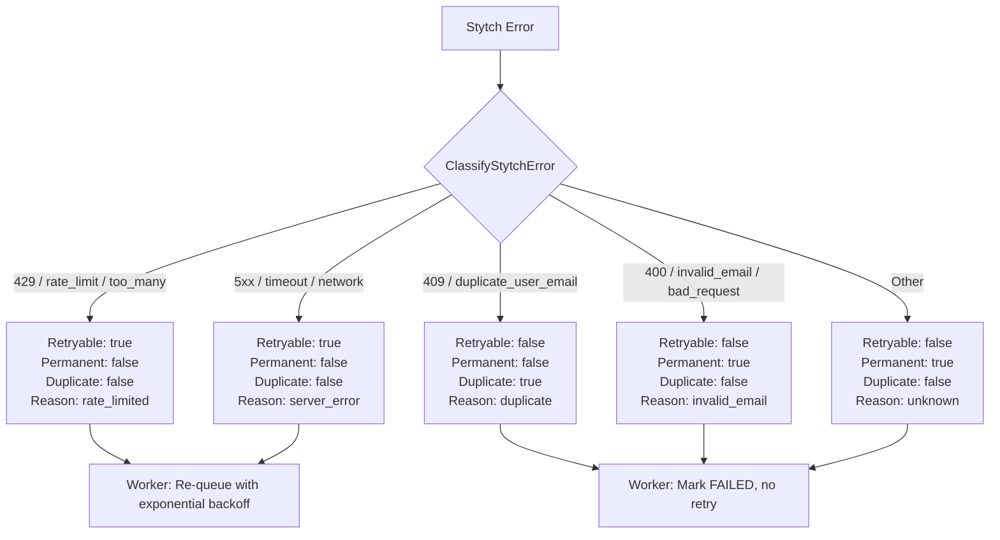
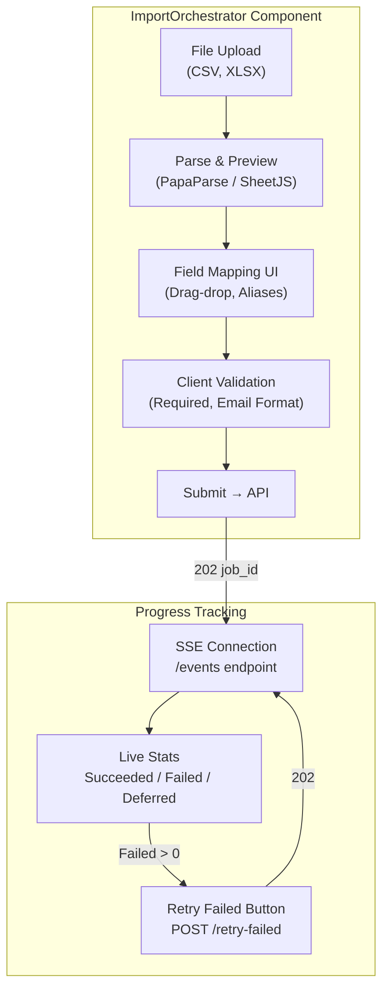

# Admin Invitations Mechanism Audit

This document provides a comprehensive audit of the admin invitations mechanism in Somotracker, including architecture, data flow, API contracts, and visual flow charts for enhanced understanding.

## System Overview {#system-overview}

The admin invitations mechanism is a **bulk job processing system** designed to handle large-scale administrator invitations (up to 10,000 per request) with reliability, idempotency, and real-time progress tracking.

### Key Components

| Component | Technology | Responsibility |
|-----------|------------|----------------|
| **API Handler** | Go (Fiber) | HTTP endpoint, validation, job creation |
| **Service Layer** | Go | Business logic, DB operations, idempotency |
| **Async Worker** | Go (Asynq/Redis) | Batch processing, Stytch integration |
| **Auth Provider** | Stytch B2B | Email magic-link invitations |
| **Frontend** | Next.js + shadcn-svelte | Import UI, progress visualization |
| **Database** | PostgreSQL | Job/Item persistence, audit trail |

---

## Architecture Flow Chart {#architecture-flow-chart}

```mermaid
flowchart TB
    subgraph FE["Frontend (Next.js)"]
        UI["ImportOrchestrator<br/>(CSV/Excel Upload)"]
        API["api.client.ts<br/>(Typed Fetch Wrapper)"]
        SSE["EventSource<br/>(SSE Progress Stream)"]
    end

    subgraph BE["Backend (Go/Fiber)"]
        MW["Middleware Chain<br/>(Session, CSRF, RateLimit)"]
        H["AdminInvitationHandler<br/>HandleInvites()"]
        SVC["AdminInvitationService<br/>(Business Logic)"]
        DB[("PostgreSQL<br/>bulk_jobs, bulk_job_items")]
        ASYNQ["Asynq Client<br/>(Task Queue)"]
        REDIS[("Redis<br/>Pub/Sub + RateLimit")]
    end

    subgraph WORKER["Async Worker (Separate Process)"]
        PROC["AdminInvitationProcessor<br/>ProcessTask()"]
        STYTCH["Stytch Client<br/>InviteMember()"]
    end

    subgraph EXT["External Services"]
        STYTCH_API["Stytch B2B API<br/>(Magic Link Invitations)"]
    end

    UI -->|1. Upload & Map Fields| API
    API -->|2. POST /api/admins/invitations<br/>BulkInvitationRequest| MW
    MW -->|3. Validated Request| H
    H -->|4. Validate & Create Job| SVC
    SVC -->|5. INSERT bulk_jobs + items| DB
    H -->|6. Enqueue Batches (size 40)| ASYNQ
    ASYNQ -->|7. Task: admin:invitation:batch| PROC
    PROC -->|8. For each item: InviteMember| STYTCH
    STYTCH -->|9. POST /v1/b2b/members/invite| STYTCH_API
    STYTCH_API -->|10. Email Sent| PROC
    PROC -->|11. Update Item Status| SVC
    SVC -->|12. UPDATE bulk_job_items| DB
    PROC -->|13. Publish Progress| REDIS
    REDIS -->|14. SSE: progress event| SSE
    SSE -->|15. Real-time UI Update| UI
```

---

## API Endpoints {#api-endpoints}

### POST `/api/admins/invitations` — Create Bulk Invitation Job

**Request:**
```typescript
interface BulkInvitationRequest {
  invitations: Array<{
    email: string;      // Required, valid email format
    full_name: string;  // Required
    role: "ADMIN" | "TEACHER" | "GUARDIAN" | "FINANCE";  // Required
  }>;
}
```

**Headers:**
- `Idempotency-Key` (optional) — Client-generated key for deduplication
- `X-CSRF-Token` — Required for mutating requests
- `X-Request-ID` — Correlation ID (auto-generated by client)

**Response (202 Accepted):**
```json
{
  "job_id": "uuid",
  "status": "QUEUED",
  "total_records": 150,
  "message": "Bulk invitation job registered successfully"
}
```

**Error Responses:**
- `400 bad_request` — Malformed JSON, empty array, >10000 items
- `400 validation_failed` — Field-level errors with row_index
- `401 unauthorized` — Missing session context
- `409 conflict` — Idempotency key already exists (returns existing job)

---

### GET `/api/admins/invitations/jobs/:job_id` — Get Job Status

**Response (200 OK):**
```json
{
  "id": "uuid",
  "job_type": "ADMIN_INVITATION",
  "idempotency_key": "inv_tenant_timestamp",
  "school_id": "uuid",
  "tenant_id": "uuid",
  "created_by": "uuid",
  "status": "PROCESSING",
  "total_records": 150,
  "succeeded_count": 45,
  "failed_count": 2,
  "deferred_count": 3,
  "metadata": {"source": "bulk_invitation"},
  "created_at": "2026-01-15T10:30:00Z",
  "updated_at": "2026-01-15T10:31:45Z"
}
```

---

### POST `/api/admins/invitations/jobs/:job_id/retry-failed` — Retry Failed Items

**Response (202 Accepted):**
```json
{
  "job_id": "uuid",
  "message": "retry queued",
  "count": 5
}
```

---

### GET `/api/admins/invitations/jobs/:job_id/events` — SSE Progress Stream

**Event Stream Format:**
```
event: progress
data: {"status":"PROCESSING","succeeded":45,"failed":2,"deferred":3,"total":150}

event: heartbeat
data: 

event: progress
data: {"status":"COMPLETED","succeeded":145,"failed":5,"deferred":0,"total":150}
```

---

## Data Model {#data-model}

### `bulk_jobs` Table

```mermaid
erDiagram
    bulk_jobs ||--o{ bulk_job_items : contains
    bulk_jobs }|--|| schools : "school_id"
    bulk_jobs }|--|| tenants : "tenant_id"
    bulk_jobs }|--|| users : "created_by"

    bulk_jobs {
        uuid id PK
        text job_type "ADMIN_INVITATION"
        text idempotency_key UK(tenant)
        uuid school_id FK
        uuid tenant_id FK
        uuid created_by FK
        text status "QUEUED|PROCESSING|COMPLETED|COMPLETED_WITH_ERRORS|FAILED"
        int total_records
        int succeeded_count
        int failed_count
        int deferred_count
        jsonb metadata
        timestamptz created_at
        timestamptz updated_at
    }
```

### `bulk_job_items` Table

```mermaid
erDiagram
    bulk_job_items {
        uuid id PK
        uuid job_id FK
        int row_index "Original payload position"
        jsonb payload "{"email":"...","full_name":"...","role":"..."}"
        jsonb result "{"stytch_invite_id":"...","stytch_member_id":"..."}"
        text status "PENDING|PROCESSING|SUCCEEDED|FAILED|DEFERRED"
        int attempt_count
        text last_error
        timestamptz created_at
        timestamptz updated_at
    }
```

### `school_memberships` — Invitation Tracking



---

## Invitation Processing Flow {#invitation-processing-flow}



---

## Error Classification & Retry Logic {#error-classification-retry-logic}

The Stytch client classifies errors to determine retry behavior:



**Retry Policy:**
- **Retryable errors**: Exponential backoff (200ms, 400ms, 800ms...) + jitter, max 3 attempts
- **Non-retryable**: Immediate FAILED status, no re-queue
- **Duplicate**: Treated as permanent failure (user already exists in Stytch)

---

## Idempotency Design {#idempotency-design}

```mermaid
flowchart LR
    Client["Client Request"] -->|Idempotency-Key Header| API
    API -->|Lookup by tenant_id + key| SVC
    SVC -->|SELECT * FROM bulk_jobs<br/>WHERE tenant_id=? AND idempotency_key=?| DB
    DB -->|Existing Job?| SVC
    SVC -->|Yes| API
    API -->|202 Accepted<br/>{job_id, status, message: "existing job returned"}| Client
    SVC -->|No| CreateJob["Create New Job"]
    CreateJob -->|INSERT bulk_jobs<br/>UNIQUE(tenant_id, idempotency_key)| DB
    DB -->|Success / Unique Violation| CreateJob
    CreateJob -->|Race: violation| RetryLookup["Retry Lookup"]
    RetryLookup --> SVC
```

**Key Properties:**
- Unique constraint: `(tenant_id, idempotency_key)` on `bulk_jobs`
- Client-generated or server-generated (format: `inv_{tenant}_{RFC3339}`)
- Returns existing job if duplicate submission detected
- Prevents duplicate invitations on network retries

---

## Frontend Integration {#frontend-integration}

### Import Flow



### Pages & Routes

| Route | Type | Component |
|-------|------|-----------|
| `/admins/invite` | Page | `ImportPage` (full-page) |
| `/@modal/(.)admins/invite` | Intercepting Modal | `ImportModalPage` (Dialog wrapper) |

Both use `ImportOrchestrator` with `ADMIN_FIELDS` schema:
- `full_name` (required)
- `email` (required, email validator)
- `role` (required, enum: ADMIN/TEACHER/GUARDIAN/FINANCE)
- `school_slug` (optional)

---

## Security Considerations {#security-considerations}

### Applied Protections

| Layer | Protection |
|-------|------------|
| **Transport** | HTTPS only, HttpOnly `session_token` cookie |
| **Authentication** | Session middleware validates session + fingerprint |
| **Authorization** | School-scoped RLS, admin-only access via role check |
| **CSRF** | Double-submit cookie pattern on mutating endpoints |
| **Rate Limiting** | IP (10/min) + Email (3/hour) on auth endpoints |
| **Input Validation** | Server-side: email format, required fields, role enum, max 10k rows |
| **Idempotency** | Unique constraint prevents duplicate job creation |
| **Circuit Breaker** | gobreaker on Stytch calls (fail fast after 5 errors/30s) |
| **Error Sanitization** | No internal details leaked to client (see `stytch.SanitizedError`) |
| **Audit Trail** | `school_memberships.invited_by`, `invited_at`, `accepted_at` |

### OWASP API Security Mapping

| OWASP API Top 10 | Mitigation |
|------------------|------------|
| **API1: Broken Object Level Authorization** | Session middleware binds `school_id`/`tenant_id` to RLS context |
| **API2: Broken Authentication** | Stytch B2B magic links, HttpOnly cookies, fingerprint validation |
| **API3: Broken Object Property Level Authorization** | Role enum validation, no mass assignment |
| **API4: Unrestricted Resource Consumption** | Max 10,000 rows/request, batch size 40, rate limits |
| **API5: Broken Function Level Authorization** | Admin-only routes protected by session + role |
| **API6: Unrestricted Access to Sensitive Business Flows** | CSRF, idempotency, audit logging |
| **API7: Server Side Request Forgery** | No outbound requests to user-supplied URLs |
| **API8: Security Misconfiguration** | Circuit breaker, secure defaults, env-based config |
| **API9: Improper Inventory Management** | Single bulk job endpoint, versioned API |
| **API10: Unsafe Consumption of APIs** | Stytch error classification, no blind retries on writes |

---

## Operational Observability {#operational-observability}

### Key Metrics to Monitor

| Metric | Source | Alert Threshold |
|--------|--------|-----------------|
| `bulk_jobs.created_total` | DB / Prometheus | — |
| `bulk_job_items.status` distribution | DB | failed_count > 5% |
| `asynq.task.duration` | Asynq metrics | p99 > 30s |
| `stytch.invite.latency` | Stytch client logs | p99 > 5s |
| `stytch.circuit_breaker.state` | gobreaker logs | OPEN state |
| `redis.pubsub.latency` | Redis metrics | > 1s |

### Debugging Failed Invitations

```sql
-- Find failed items for a job
SELECT row_index, payload, last_error, attempt_count
FROM bulk_job_items
WHERE job_id = '...' AND status = 'FAILED'
ORDER BY row_index;

-- Job summary
SELECT status, total_records, succeeded_count, failed_count, deferred_count
FROM bulk_jobs
WHERE id = '...';
```

---

## Future Enhancements {#future-enhancements}

1. **Webhook Callbacks** — Notify external systems on invitation acceptance
2. **Role Templates** — Pre-defined permission sets beyond current 4 roles
3. **Scheduled Invitations** — Send at specific date/time
4. **Invitation Expiry** — Auto-expire after configurable TTL (currently Stytch-managed)
5. **Batch CSV Export** — Download failed/succeeded items as CSV
6. **Multi-tenant Bulk** — Single request across multiple schools (requires super-admin)

---

## Related Documentation

- [API Reference](./api-reference.mdx)
- [Error Handling Standard](./error-handling.md)
- [Database Schema Reference](./database-schema-reference.md)
- [Middleware Reference](./middleware-reference.md)
- [Backend Security Audit](./backend-security-audit.md)

---

*Last updated: 2026-01-15*  
*Version: 1.0.0*  
*Owner: Platform Team*