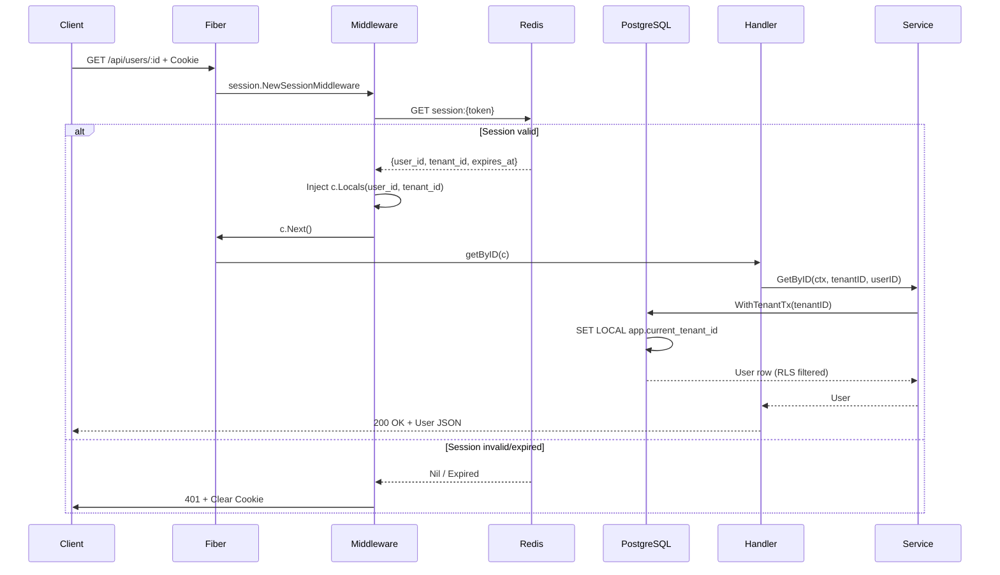

# Somotracker API Reference

## Overview

The Somotracker API is a RESTful service built with Go Fiber v3 that provides secure, multi-tenant educational data access. The API follows a **passwordless authentication model** using magic links and implements **Row-Level Security (RLS)** at the database layer for tenant isolation.

### Base URL

```
Production:  https://api.somotracker.com
Development: http://localhost:8080
```

### Content Type

All requests and responses use JSON unless otherwise specified.

```
Content-Type: application/json
```

### Versioning

API version is embedded in the URL path: `/api/v1/...`

---

## Authentication & Authorization {#authentication}

### Passwordless Magic Link Flow

Somotracker uses **passwordless authentication** via email magic links powered by Stytch B2B. No passwords are stored or transmitted.

#### 1. Request Magic Link

Initiate authentication by sending a magic link to the user's email.

```http
POST /api/auth/magic-link/send
Content-Type: application/json

{
  "email": "user@example.com",
  "org_id": "optional-org-slug"
}
```

**Response (200 OK):**

```json
{
  "code": "magic_link_sent",
  "message": "If that email is registered, a magic link has been sent.",
  "errors": {}
}
```

> **Security Note:** The response is intentionally generic to prevent user enumeration attacks.

#### 2. Magic Link Callback

Stytch redirects the user's browser to this endpoint with a token. The endpoint validates the token, provisions the user/tenant if needed, and sets an **HttpOnly, Secure, SameSite=Lax** session cookie.

```http
GET /api/auth/callback?token={stytch_magic_link_token}
```

**Response (200 OK):**

```json
{
  "code": "authenticated",
  "message": "Authentication successful",
  "errors": {}
}
```

**Cookie Set:**

```
Set-Cookie: session_token={opaque_token}; Path=/; HttpOnly; Secure; SameSite=Lax; Expires={7d}
```

> **Important:** The raw Stytch session token is **never** exposed to client-side JavaScript. Only an opaque server-issued token is stored in the cookie.

---

## Session Management {#session-management}

### Session Cookie

Authenticated requests must include the `session_token` cookie issued during the callback.

```
Cookie: session_token={opaque_token}
```

The session middleware validates this cookie against Redis on every protected request.

### Session Validation Middleware

All protected routes are guarded by the session middleware (`session.NewSessionMiddleware`) which:

1. **Extracts** the `session_token` cookie
2. **Queries Redis** for session metadata using key `session:{token}`
3. **Verifies** session exists and `expires_at > now`
4. **Injects** tenant context into Fiber locals:
   - `c.Locals("user_id")` — authenticated user UUID
   - `c.Locals("tenant_id")` — organization/tenant UUID
   - `c.Locals("stytch_session_id")` — original Stytch session ID
5. **Returns 401** with sanitized message on any failure

### Session Data Structure (Redis)

```json
{
  "user_id": "uuid-string",
  "tenant_id": "uuid-string",
  "stytch_session_id": "stytch-session-uuid",
  "expires_at": "2024-12-31T23:59:59Z"
}
```

- **Redis TTL:** 6 hours (cache layer)
- **Database TTL:** 7 days (source of truth)

### Session Expiry & Cleanup

- Expired sessions → 401 + cookie cleared (`Max-Age=-1`)
- Missing/invalid sessions → 401 + cookie cleared
- Redis errors → 401 (fail closed)

---

## Protected Endpoints {#protected-endpoints}

All protected endpoints require a valid `session_token` cookie and are scoped to the authenticated tenant via RLS.

### Get User by ID

```http
GET /api/users/:id
Cookie: session_token={token}
```

**Path Parameters:**

| Parameter | Type   | Description          |
|-----------|--------|----------------------|
| `id`      | string | User UUID            |

**Response (200 OK):**

```json
{
  "id": "uuid",
  "email": "user@example.com",
  "tenant_id": "uuid",
  "full_name": "John Doe",
  "is_active": true,
  "external_auth_id": "stytch-member-id",
  "created_at": "2024-01-15T10:30:00Z",
  "updated_at": "2024-01-15T10:30:00Z"
}
```

### Get User by Email

```http
GET /api/users/email/:email
Cookie: session_token={token}
```

**Path Parameters:**

| Parameter | Type   | Description     |
|-----------|--------|-----------------|
| `email`   | string | User email      |

**Response (200 OK):**

```json
{
  "id": "uuid",
  "email": "user@example.com",
  "tenant_id": "uuid",
  "full_name": "John Doe",
  "is_active": true,
  "external_auth_id": "stytch-member-id",
  "created_at": "2024-01-15T10:30:00Z",
  "updated_at": "2024-01-15T10:30:00Z"
}
```

### Get Tenant by Slug

```http
GET /api/tenants/slug/:slug
Cookie: session_token={token}
```

**Path Parameters:**

| Parameter | Type   | Description        |
|-----------|--------|--------------------|
| `slug`    | string | Tenant slug (org)  |

**Response (200 OK):**

```json
{
  "id": "uuid",
  "name": "Acme University",
  "slug": "acme-university",
  "stytch_org_id": "stytch-org-uuid",
  "created_at": "2024-01-15T10:30:00Z"
}
```

---

## Error Response Format {#error-format}

All non-2xx responses follow the canonical error contract:

```json
{
  "code": "snake_case_error_code",
  "message": "Human readable message",
  "errors": { "field_name": ["Specific validation message"] }
}
```

### Common Error Codes

| HTTP Status | Code                 | Description                              |
|-------------|----------------------|------------------------------------------|
| 400         | `missing_email`      | Email field is required                  |
| 400         | `invalid_request`    | Malformed request or invalid parameters  |
| 400         | `invalid_uuid`       | UUID format invalid                      |
| 401         | `unauthorized`       | Missing/invalid/expired session          |
| 401         | `unauthorized`       | Tenant context missing                   |
| 404         | `not_found`          | Resource not found                       |
| 429         | `rate_limit_exceeded`| Too many requests                        |
| 500         | `internal_error`     | Unexpected server error                  |
| 503         | `database_unavailable`| PostgreSQL unreachable                   |

### Example: 401 Unauthorized

```json
{
  "code": "unauthorized",
  "message": "Unauthorized. Please log in to continue.",
  "errors": {}
}
```

> **Security:** Error messages never leak internal details, token values, or database keys.

---

## Rate Limiting {#rate-limiting}

Rate limits are enforced per-client using Redis-backed sliding windows.

### Limits

| Endpoint                         | Limit        | Window     |
|----------------------------------|--------------|------------|
| `POST /api/auth/magic-link/send` | 10 requests  | 1 minute   |
| `GET /api/auth/callback`         | 10 requests  | 1 minute   |

### Response Headers

Successful requests include rate limit headers:

```
X-RateLimit-Limit: 10
X-RateLimit-Remaining: 9
X-RateLimit-Reset: 1703980800000
```

### 429 Response

```json
{
  "code": "rate_limit_exceeded",
  "message": "Too many requests. Please wait a few minutes before trying again.",
  "errors": {}
}
```

```
Retry-After: 45
```

---

## Multi-Tenant Architecture (RLS) {#multi-tenant-rls}

### Row-Level Security Model

Every tenant's data is isolated at the **database level** using PostgreSQL Row-Level Security policies.

#### Database GUC

The session middleware sets the tenant context on every transaction:

```sql
SET LOCAL app.current_tenant_id = '<tenant-uuid>';
```

This GUC is read by RLS policies on all tenant-scoped tables:

```sql
-- Example RLS policy on users table
CREATE POLICY users_tenant_isolation ON users
  FOR ALL
  USING (tenant_id = current_setting('app.current_tenant_id')::uuid)
  WITH CHECK (tenant_id = current_setting('app.current_tenant_id')::uuid);
```

#### Transaction Wrapper

Services use `database.WithTenantTx(ctx, pool, logger, tenantID, fn)` which:

1. Begins a transaction
2. Executes `SET LOCAL app.current_tenant_id = $1`
3. Runs the callback (all queries auto-scoped to tenant)
4. Commits or rolls back

This guarantees **zero tenant leakage** even with connection pooling.

---

## Request Flow Diagram {#request-flow}



---

## Request ID Tracing {#request-id}

Every request receives a unique `X-Request-ID` header (UUIDv4). If the client provides one, it is echoed; otherwise a new one is generated.

```
X-Request-ID: 550e8400-e29b-41d4-a716-446655440000
```

This ID is:
- Returned in response headers
- Injected into logger context for structured logging
- Available in `c.Locals("request_id")` and `context.Context`
- Propagated to database spans via OpenTelemetry

---

## Health & Readiness {#health}

### Liveness

```http
GET /livez
```

Returns `200 OK` if process is running (no I/O).

### Readiness

```http
GET /readyz
```

Returns `200 OK` only if PostgreSQL is reachable. Returns `503` with `database_unavailable` code if DB ping fails.

### Health

```http
GET /health
```

```json
{
  "status": "ok",
  "service": "somotracker-api"
}
```

---

## Security Headers {#security-headers}

All responses include:

| Header | Value |
|--------|-------|
| `X-Content-Type-Options` | `nosniff` |
| `X-Frame-Options` | `DENY` |
| `X-Request-ID` | UUIDv4 |
| `Content-Security-Policy` | `default-src 'none'` (API only) |

Session cookie attributes:
- `HttpOnly` — No JavaScript access
- `Secure` — HTTPS only
- `SameSite=Lax` — CSRF protection
- `Path=/` — All routes

---

## Quick Reference {#quick-reference}

### Public Endpoints (No Auth)

| Method | Path | Description |
|--------|------|-------------|
| `POST` | `/api/auth/magic-link/send` | Request magic link |
| `GET` | `/api/auth/callback` | Magic link callback |
| `GET` | `/health` | Service health |
| `GET` | `/livez` | Liveness probe |
| `GET` | `/readyz` | Readiness probe |

### Protected Endpoints (Require Session Cookie)

| Method | Path | Description |
|--------|------|-------------|
| `GET` | `/api/users/:id` | Get user by UUID |
| `GET` | `/api/users/email/:email` | Get user by email |
| `GET` | `/api/tenants/slug/:slug` | Get tenant by slug |

---

## Implementation Notes for Consumers {#implementation-notes}

1. **Cookie Handling:** Your HTTP client must support cookie jars (automatic storage/sending of `session_token`).

2. **Redirect Handling:** The `/api/auth/callback` endpoint is designed for browser redirects from Stytch. Programmatic clients should handle the 302 flow or use the magic link token directly with the callback endpoint.

3. **Session Renewal:** Sessions expire after 7 days (DB) / 6 hours (Redis cache). Implement automatic re-authentication on 401 responses.

4. **Tenant Context:** Never pass tenant IDs via headers or query params on protected endpoints — they are derived from the session and enforced by RLS.

5. **Idempotency:** Magic link sends are idempotent (safe to retry). Callback validation is single-use per token.

6. **Error Handling:** Always check `code` field, not HTTP status alone, for programmatic error handling.