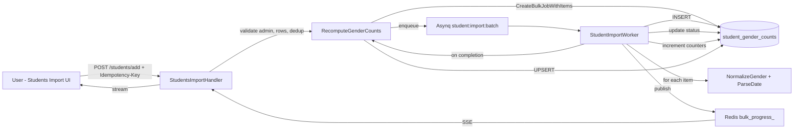

# Student Bulk Import Flow

## Overview
Students are imported as SIS-only records via the existing bulk-job / ImportOrchestrator stack. No user accounts, no Stytch provisioning, no class enrollment. Gender distribution per school is maintained in a denormalized table `student_gender_counts` and recomputed on job completion.

## Request / Response Contract

### Frontend → Backend
`POST /api/students/add`
Headers:
```
Idempotency-Key: <uuid>
Authorization: session cookie
```
Body:
```json
{
  "students": [
    {
      "admission_number": "string",   // required, unique per school
      "full_name": "string",
      "date_of_birth": "string",     // tolerant parser
      "gender": "M|F|OTHER|variants",
      "metadata": { ... }            // optional
    }
  ]
}
```
Response `202 Accepted`:
```json
{
  "job_id": "uuid",
  "status": "QUEUED",
  "total": 50
}
```

### Progress
`GET /api/students/jobs/:job_id`
`GET /api/students/jobs/:job_id/events` → SSE
Progress payload:
```json
{
  "status": "QUEUED|PROCESSING|COMPLETED|COMPLETED_WITH_ERRORS",
  "succeeded": 0,
  "failed": 0,
  "deferred": 0,
  "total": 50
}
```

## Architecture Diagram



## Step-by-Step Flow

### 1. Frontend Upload / Manual Import
* Page `/students/add` renders `StudentsImportOrchestrator`.
* Upload CSV or Manual Import tab builds `students[]` payload.
* `useStudentImport` posts to `/api/students/add` with `Idempotency-Key`.

### 2. Handler Validation
`backend/internal/api/students_import_handler.go`
* Auth: active school from session, user role ADMIN.
* Idempotency: `GET /students/jobs` by `idempotency_key` → return existing job if present.
* Row validation:
  * `admission_number` required, non-empty.
  * `full_name` required.
  * `date_of_birth` parsed via `services.ParseDate` tolerant layouts.
  * `gender` normalized via `services.NormalizeGender` → `M|F|OTHER`.
* Deduplication within file: first occurrence wins; subsequent duplicates marked `FAILED` immediately.
* Max rows 10k, rate limited.

### 3. Bulk Job Creation
`StudentImportService.CreateBulkJobWithItems`
* `INSERT INTO bulk_jobs` with `job_type = STUDENT_IMPORT`, `status = QUEUED`, `total_records = n`.
* For each validated row `INSERT INTO bulk_job_items` with `payload = json`, `status = PENDING`.
* Returns `job_id`.

### 4. Asynq Enqueue
Handler batches item IDs into `student:import:batch` tasks:
```json
{
  "job_id": "...",
  "batch_index": 0,
  "item_ids": ["uuid1", "uuid2", ...]
}
```
Queue `student_import`.

### 5. Worker Processing
`backend/internal/worker/student_import_worker.go` `StudentImportProcessor.ProcessTask`
* Set job status → `PROCESSING`.
* For each item:
  1. Load `bulk_job_items` payload.
  2. Normalize gender, parse DOB.
  3. `InsertStudent` → `INSERT INTO students (school_id, admission_number, full_name, date_of_birth, gender, metadata)`.
  4. On unique violation `admission_number` → item `FAILED`, job `failed++`.
  5. On success → item `SUCCEEDED`, job `succeeded++`.
  6. On transient DB error → item `DEFERRED`.
* Publish progress to Redis channel `bulk_progress_<job_id>`.

### 6. Completion & Gender Counts
When all items processed:
* Derive final job status: `COMPLETED` or `COMPLETED_WITH_ERRORS`.
* `StudentImportService.RecomputeGenderCounts(school_id)` → Option B:
  ```sql
  INSERT INTO student_gender_counts ...
  SELECT school_id, COUNT(*) FILTER (WHERE upper(gender) IN ('M','MALE')), ...
  FROM students WHERE school_id = $1
  ON CONFLICT (school_id) DO UPDATE ...
  ```
* Publish final progress.

### 7. Frontend Progress UI
`ImportOrchestrator` subscribes to `/students/jobs/:job_id/events` SSE:
* Renders progress bar, succeeded/failed counts.
* On completion shows summary and link to `/students` listing.

## Data Model Touchpoints
* `bulk_jobs` – `job_type` includes `STUDENT_IMPORT` via migration `000017_add_student_bulk_import_support`.
* `bulk_job_items` – one per student row.
* `students` – SIS record, unique `(school_id, admission_number)`.
* `student_gender_counts` – denormalized aggregates per school, updated on job completion.

## Error Handling
* Validation errors → `400` with canonical error body `{code, message, errors}`.
* Duplicate admission number in DB → item `FAILED`, job continues.
* Idempotency → repeated POST with same key returns existing job, no duplicate work.
* All errors returned up the stack with context, logged once at handler/worker layer.

## Permissions
* `ADMIN` only on school membership.
* Rate limiting `bulkInviteRate` reused for student import.

## Testing
* Migration integration test: `TestMigrator_AddStudentBulkImportSupport`.
* End-to-end: POST with Idempotency-Key → verify job status via SSE → verify rows in `students` and counts in `student_gender_counts`.
